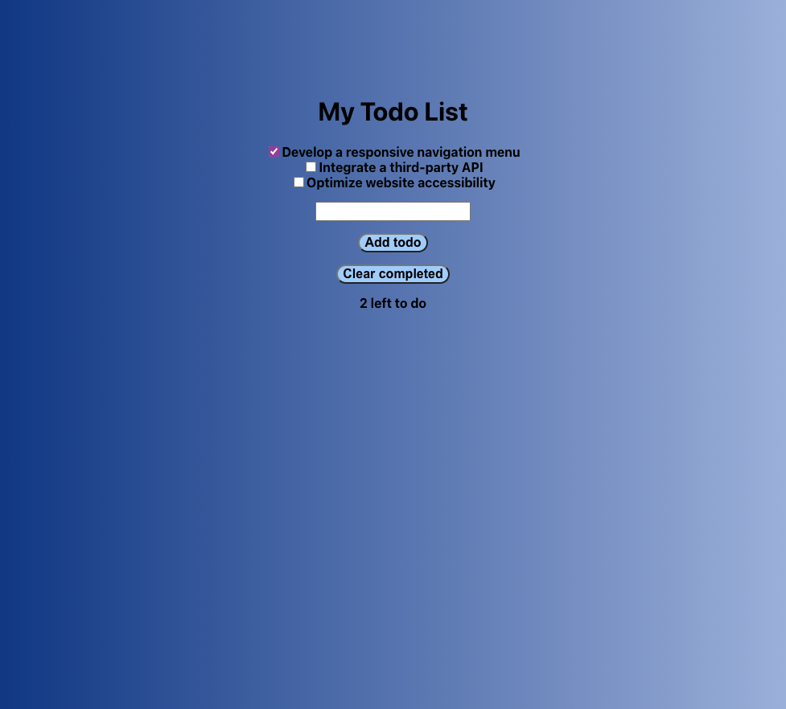

# My Todos

  [](https://opensource.org/license/MIT)


## Table Of Content

- [Description](#description)
- [Deployed website link](#deployedWebsite)
- [Installation](#installation)
- [Usage](#usage)

- [Tests](#tests)
- [GitHub](#github)

- [License](#license)


  


## Description

  This is a Todo List application written in React. The application allows the user to add new tasks to a list, mark them as completed, and remove completed tasks from the list.

The application is built using React components and hooks, which allow for efficient management of state and dynamic rendering of the UI. The App component contains the main logic of the application, including the state management and handling of user events such as adding, completing, and removing tasks.

The TodoList component receives the current list of tasks as props and renders a list of Todo components for each task. Each Todo component displays a checkbox and the name of the task, and can be clicked to toggle its completion status.

The application also utilizes the useRef and useEffect hooks to manage input fields and local storage, respectively. The useRef hook is used to create a reference to the input field where users can add new tasks. The useEffect hook is used to persist the task list in local storage, allowing the user to return to the application and see their previous list of tasks.

Overall, this application provides a simple and intuitive way for users to manage their daily tasks and stay organized.


<p>Deployed website: <strong><a href="https://antonscheving.github.io/my-todos/">https://antonscheving.github.io/my-todos/</a></strong>


<p align="center">
  <br>
My Todos website screenshot
</p>


## Installation

To install and run the Todo List application locally, follow these steps:

1. Clone the repository from GitHub:

```

git clone https://github.com/antonscheving/my-todos.git

```

1. Navigate to the project directory:

```

cd my-todos

```

1. Install the dependencies using npm:

```

npm install uuid

```

1. Run the application:

```

npm start

```

1. Open your web browser and go to **`http://localhost:3000`** to view the application.

Note: This application requires Node.js to be installed on your computer. If you don't have Node.js installed, you can download it from the official website: **[https://nodejs.org/en/download/](https://nodejs.org/en/download/)**


My Todos is built with the following tools and libraries: <ul><li>JavaScript</li> <li>Node.js</li> <li>REACT</li> <li>HTML</li> <li>CSS</li></ul>


Here are instructions on how to deploy the site on Github https://github.com/gitname/react-gh-pages


## Usage
 
To use the code, you can copy and paste it into your own React project. You should be able to see the todo application in your browser. The application allows you to add new tasks, mark tasks as complete, and remove completed tasks.


## Tests
 
No tests are provided in this code. However, you can write your own tests using a testing library such as Jest.


## GitHub

<a href="https://github.com/AntonScheving"><strong>AntonScheving</a></strong>


<p>Visit my website: <strong><a href="www.antonscheving.com">AntonScheving.com</a></strong></p>


## License

[](https://opensource.org/license/MIT)


